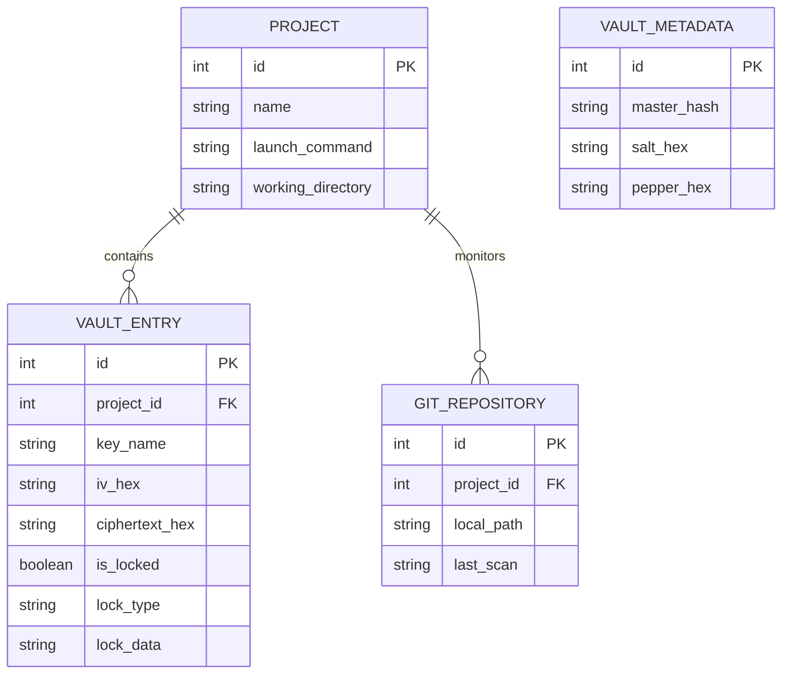
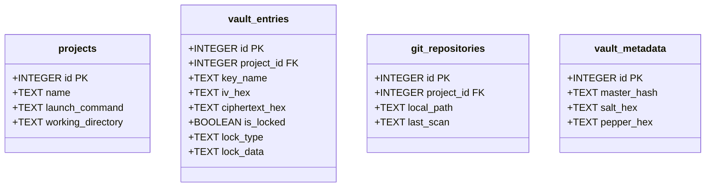
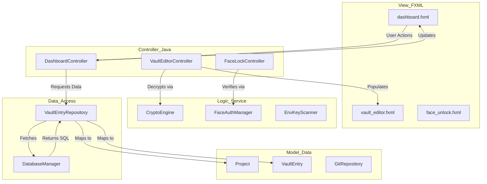

# System Diagrams

This document provides visual representations of the Secure Environment Variable Vault system.

## 1. Entity Relationship Diagram (ERD)
The following diagram illustrates the logical data relationships within the vault's SQLite database.

---

## 2. Database Table Structure
A detailed view of the physical storage schema used in `vault.db`.

---

## 3. MVC Architecture Flow
This diagram shows how user interactions flow through the system components.

